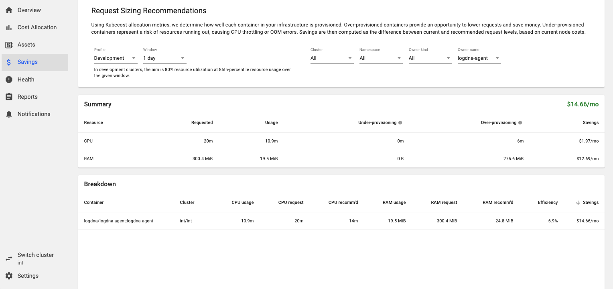

# How to be a Good Kubernetes Neighbor - Lab

Welcome to the lab component of "How to be a Good Kubernetes Neighbor"!
- [How to be a Good Kubernetes Neighbor - Lab](#how-to-be-a-good-kubernetes-neighbor---lab)
  - [Estimated Time](#estimated-time)
  - [Target Audience](#target-audience)
  - [Learning Objectives](#learning-objectives)
  - [Prerequites](#prerequites)
  - [Steps](#steps)
    - [Inspect the Deployment Files](#inspect-the-deployment-files)
    - [Why Are We Doing This?](#why-are-we-doing-this)
    - [Using Kubecost to Get the Recommendations](#using-kubecost-to-get-the-recommendations)
    - [Inspect Recommendations](#inspect-recommendations)
    - [Update Resources Limits](#update-resources-limits)
    - [Add Team Label](#add-team-label)
    - [What about Stage and Production Environments?](#what-about-stage-and-production-environments)
  - [Completion and Next Steps](#completion-and-next-steps)

## Estimated Time

15 minutes

## Target Audience

Namely Software Engineers who are interested to learn how to adjust the resource requests for their applications. Basic Kubernetes knowledge is recommended but not necessary.

## Learning Objectives

By the end of this lab, you should be able to:
- Label your Kubernetes resources to display ownership by updating and applying their manifest files
- Appropriately adjust your resources requests using Kubecost’s Request Sizing Recommendations feature

## Prerequites

1. If you have done so already, clone this repo locally:
    ```
    git clone git@github.com:namely/rightsizing-poc.git
    ```
2. Navigate to the `rightsizing-poc` folder. There should be 3 yaml files (aka manifests) in there. These are the configuration files for 1 simple nginx deployment for each environment:
    ```
    cd rightsizing-poc/
    ```

## Steps

### Inspect the Deployment Files

1. Open `deployment-int.yaml` in your favorite text editor (e.g. VSCode).
2. Look at line 22-25. These are the resources that this deployment is requesting:
    ```yaml
    resources:
      requests:
        cpu: 20m
        memory: 300Mi
    ```

The other two deployment files also share the same request values. At this point, we may have the following questions:
 - shouldn't higher environments allocate more resources than the lower ones (e.g. prd > stg > int), since it has more traffic?
 - are these the right value? In other words, are we requesting too much resources (aka overprovisioning)...or too little (aka underprovisioning)?

This is where Kubecost comes in. We use Kubecost to help analyze past metrics and to recommend the correct CPU and memory values.

### Why Are We Doing This?

If your containers are **overprovisioned**, you are taking up resources that could have otherwise used by other containers. In other words, you are being a **bad neighbor**! Moreover, the unused resources are costing extra money too. :money_with_wings:

If your containers are **underprovisioned**, your application may suffer from poor performances, or even shuts off unexpectedly.

### Using Kubecost to Get the Recommendations

1. On your web browser, open the Kubecost **Request Sizing Recommendations** page: https://kubecost.namely.land/request-sizing.html.
2. Since we are doing the *int* environment first, click the **Switch Cluster** button on the lower-left corner and switch to *int*.
3. In the main viewport, change the following values:
   1. **Profile**: choose *Development* (*Production* profile is for *stg* and *prd* clusters)
   2. **Window**: for this lab, choose *1 day* (though normally you would choose 7 or 30 days)
   
   Wait for the sections to finish rendering - it may take 30-60 seconds.
4. Before moving on, let's scroll down to inspect the rendered sections. The **Summary** section shows how much we can potentially save by adjusting the requests in the cluster. It can be thousands of dollars per month per cluster - a pretty significant amount.

   The **Breakdown** section lists all individual containers (aka daemonset, deployment, job, replicaset) in the cluster. By default, they are sorted by the amount of potential savings per month, but all columns can be sorted. Feel free to play around with them for a minute.
5. You may notice that there are hundreds of containers available and it can be hard to find your containers. Scroll back up to the **Request Sizing Recommendations** and locate the **Owner Name** filter. Using this filter, you can limit the results to those that match the container's name (from the manifest's metadata). For this lab, we will be using `logdna-agent` as the owner name.

Here is what the page should look like at this point:


Since the metrics and recommendations change all the time, for consistency we will be using the numbers from the above screenshot to proceed.

### Inspect Recommendations

In the screenshot, locate the `logdna-agent` container in the **Breakdown** section near the bottom. 

The CPU usage is `10.9m` and the CPU request is `20m`, so Kubecost is recommending a slightly smaller request at `14m`. On the other hand, RAM usage is only `19.5MiB` but this container is requesting `300.MiB` - a classic case of **bad neighbor**! Kubecost is recommending a much smaller number at `24.8MiB`, which we can round up to `25MiB`.

Before moving on, let's look at the last two columns. The **Efficiency** column is calculated by aggregating the usage:request ratios of both CPU and memory - typically a high % means that the usage matches the requests very well. Unfortunately, this container has a low, low score of 6.9%! :scream:

It is important to note that 100% (or over 100%!!) efficiency score doesn't always mean that the container is healthy. Rather, it can mean that:
1. no requests are set, which is not a good practice
2. the containers are under-provisioned

So the bottom line is that don't solely rely the efficiency score to determine the containers health, but a score too low or too high will almost certainly indicate that the requests should be adjusted.

Finally, the **Savings** column shows you how much you can save by resizing the requests. $14.66/mo for 1 container may not seem much, but when we concert our effort to resize hundreds of containers, the savings can be significant.

Next, we will copy the recommended numbers (`14m` and `25MiB` rounded up) and update them into our manifest file.

### Update Resources Limits

Open `deployment-int.yaml` again in your text editor. In line 24, replaced the `cpu` value with `14m` and in line 25, replaced the `memory` value with `25MiB`. 

The `resources` block should look like this now:
```yaml
resources:
  requests:
    cpu: 14m
    memory: 25Mi
```

Save the file, but there's one more thing that we should add...the team label.

### Add Team Label

It is generally a good practice to establish ownership so we know who "owns" what. Looking at `deployment-int.yaml`, we have no idea which team "owns" it. A way to do this in Kubernetes is to put a [label](https://kubernetes.io/docs/concepts/overview/working-with-objects/labels/) on the pods. 

Amongst other things, Kubecost uses this label to break down the cost incurred per team so we can see which team is using more resources! :smiling_imp:

Return to `deployment-int.yaml`. We will add a new key value `team: <your team name>` under `spec.template.metadata.labels`, or under line 15. Doing so will add this label to all the pods the deployment creates.


the `spec.template.metadata.labels` should look like this now:
```yaml
spec:
  replicas: 3
  selector:
    matchLabels:
      app: nginx
  template:
    metadata:
      labels:
        app: nginx
        team: my-team
```

The lab stops here. In a real-life scenario, you would be applying the manifest to redeploy the pods, and Kubecost will reflect the changes ~2 hours after the redeployment.

Just to show you the outcome, here is what `logdna-agent` in the *int* cluster looks like after rightsizing:


not bad, right? We saved $13/mo!

### What about Stage and Production Environments?

The steps for higher level environments are the same as above, except that:
- you will need to switch the cluster (lower-left corner in the UI) to *stg* or *prd*
- you are going to use *Production* profile instead of *Development*, since we are expecting higher resource utilization

choosing the different cluster and profile will generate a different set of recommendations (more than likely higher values).You may then update the corresponding manifests and apply.

## Completion and Next Steps

In this lab, you have retrieved the recommended requests values from Kubecost, and updated the manifests accordingly. You have also added a team label to the metadata to establish team ownership. 

In a real-life scenario, instead of having a manifest for each environment which requires you to update the files one-by-one, you may use tools like Spinnaker to parameterize the manifests instead. 

You will also not likely to use the 1-day window because that's too small and doesn't cover "spikes":
- choose `7 days` if your application has a "daily" cycle of activity
- choose `30 days` if your application has more of a "weekly" or "monthly" cycle of activity

The bottom line is, by using Kubecost to rightsize your resource requests, you are being a good neighbor and saving Namely some money! :moneybag: